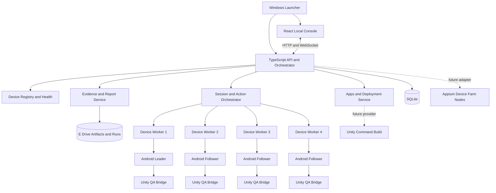

# Unity Multi-Device Test Center Design

- Date: 2026-07-31
- Status: Design approved in five review sections; awaiting written-spec review
- Project root: `E:\Projects\UnityMultiDeviceTestCenter`
- Target platform: Windows host with 1-4 locally connected Android devices

## 1. Summary

Build a local Windows tool for Unity Android package testing. A tester operates one selected leader device through a live computer view. The platform records each action and, when followers are selected, dispatches the action concurrently to up to three follower devices. It then correlates per-device results, Unity QA state, screenshots, logs, videos, and reports.

The product borrows the useful information architecture of Appium Device Farm, including Devices, Apps, Builds/Deployments, Sessions, and Results. It does not fork Appium Device Farm for the first version. The live synchronization controller, Unity bridge, and evidence model are independent so upstream Device Farm changes do not control the core product.

## 2. Confirmed Decisions

| Area | Decision |
|---|---|
| Operating mode | Operate the leader from its live computer view. Physical finger capture on the leader is a later feature. |
| Capacity | A run selects 1-4 connected devices. Exactly one is the leader; the remaining 0-3 are followers. |
| Single-device behavior | A one-device run records actions and evidence without broadcasting. |
| Packages | Accept APK, AAB, and a version already installed on selected devices. |
| Accounts | The game creates an independent account from device ID. The platform does not allocate or log in accounts. |
| UID | A QA-only Unity bridge reports the UID, which is stored against device serial and app version. Manual correction is a fallback. |
| First-version actions | Tap, long press, drag/swipe, Back, text input, activate, terminate, and restart. |
| Later actions | Multi-touch, pinch/zoom, responsive cross-orientation mapping, and physical-leader touch capture. |
| Failure policy | Each run selects either pause-all or quarantine-failed-device. Pause-all is the default. |
| Reports | Always create platform history, offline HTML, and an evidence ZIP. Let the user optionally export Excel, PDF, or JUnit. |
| Unity builds | The first version imports existing outputs. It defines a `BuildProvider` contract so a Unity command-build provider can be added later. |
| Storage | Source, dependencies, application data, artifacts, and evidence remain on `E:`. |
| Access | Localhost only in the first version. No public or multi-tenant control plane. |

## 3. Goals

1. Reduce repeated manual testing by applying one human-driven workflow to 1-4 Android devices.
2. Preserve device isolation: every ADB command, Appium session, port, log stream, and evidence path belongs to one serial.
3. Work with Unity-rendered UI where Android accessibility trees may not expose meaningful elements.
4. Make every action and outcome traceable by `runId`, `actionId`, device serial, UID, and artifact version.
5. Provide Device Farm-style visual management for devices, apps, deployments, sessions, and results.
6. Deliver in atomic M0-M11 milestones, each requiring explicit user acceptance before the next begins.
7. Keep extension contracts for Unity builds and future Device Farm nodes without putting either in the first-version critical path.

## 4. Non-Goals

The first version does not include:

- Capturing physical finger input from a stock leader handset.
- Multi-touch, pinch, or arbitrary raw-event replay.
- Reliable mapping between layouts that reflow differently across portrait and landscape.
- More than four selected devices in one local run.
- Multiple Windows hosts, Device Farm hub/node allocation, remote device queues, or team tenancy.
- Public network access.
- A Unity build implementation. Only its provider interface is included.
- Unity bridge calls into gameplay methods. The bridge observes state and correlates input; it does not bypass real UI interaction.

## 5. Local Environment Baseline

The design was based on a read-only inspection on 2026-07-31:

- Unity `2022.3.62f2` is installed at `D:\Unity\Editor` with Android SDK, NDK, OpenJDK, and Gradle.
- ADB `35.0.0` is available. One Samsung Galaxy S24 Ultra (`SM-S9280`) was connected during discovery.
- The Android SDK environment points to Unity's Android SDK.
- The machine has multiple Java installations. Child processes must receive explicit tool paths and environment values instead of relying on bare `java`.
- Global Node is `26.4.0`, but Appium and project dependencies are not installed.
- Python `D:\python3\python.exe` has an Appium Python client, but the platform will not depend on Python for its core runtime.
- `E:` had about 606 GiB free. The platform still enforces evidence-space thresholds.

This baseline is evidence, not a permanent assumption. M0 reruns all checks and records the current values.

## 6. Final Product Form

The completed product is a portable Windows directory, not a collection of scripts:

1. A thin Windows launcher starts and stops child services, runs environment checks, opens the local console, and displays process health.
2. A local React management console provides all operational pages.
3. A Node.js 22 LTS and TypeScript service owns device discovery, deployment, sessions, actions, evidence, and reports.
4. Appium 3 and UiAutomator2 provide one isolated automation session per selected device.
5. A QA-only Unity bridge reports UID, safe area, orientation, view/state, and action receipts.
6. A SQLite database stores queryable metadata. Large artifacts and evidence stay in the `data` directory on `E:`.
7. Offline HTML and ZIP are automatic. Excel, PDF, and JUnit are selectable export jobs.

The launcher must use pinned project-local tools where practical. It must not depend on the globally installed Node 26, bare Java 21, or implicit PATH ordering.

## 7. System Architecture



### 7.1 Windows Launcher

Responsibilities:

- Start only the pinned local runtime and child services.
- Pass explicit `ANDROID_HOME`, `JAVA_HOME`, tool paths, storage paths, and port ranges to child processes.
- Run M0 self-checks without modifying global environment variables.
- Open the local console at `127.0.0.1`.
- Shut down child processes cleanly and surface crash logs.

The implementation plan will choose a thin Windows executable technology. Its behavior is fixed by this contract regardless of packaging technology.

### 7.2 React Local Console

Responsibilities:

- Render the operational pages described in section 8.
- Receive live device, run, action, and export updates over WebSocket.
- Capture leader pointer and keyboard intent through an overlay over the leader view.
- Never own authoritative run state. Browser refresh reconstructs state from the API and database.
- Require explicit confirmation for data clearing, uninstall, and other destructive operations.

### 7.3 TypeScript Core

The core contains bounded modules:

- `device-registry`: ADB discovery, health, metadata, UID association, tags, and occupancy.
- `artifact-service`: APK/AAB/installed-version records and immutable artifact metadata.
- `deployment-service`: AAB conversion, install, clear-data option, launch, and version verification.
- `session-orchestrator`: run state, selected leader/followers, action creation, concurrent dispatch, and failure policy.
- `worker-manager`: isolated Appium, ADB, logcat, bridge, and view resources per serial.
- `evidence-service`: screenshots, videos, logs, state snapshots, hashes, and evidence indexing.
- `report-service`: offline HTML/ZIP and optional Excel/PDF/JUnit export jobs.
- `settings-service`: explicit project-local paths, ports, evidence policy, and retention settings.

### 7.4 Device Worker

Each selected serial gets one worker with:

- One Appium session with explicit `udid`.
- A unique UiAutomator2 `systemPort`.
- Unique MJPEG/Chromedriver ports when those facilities are enabled.
- Every ADB command invoked with `-s <serial>`.
- One logcat stream and one evidence directory.
- One Unity bridge correlation state.
- One view-provider instance or preview subscription.

No device-global singleton may hold serial-specific state.

### 7.5 ViewProvider

The browser must show the leader inside the management console. Streaming is isolated behind:

```ts
interface ViewProvider {
  start(deviceSerial: string, profile: ViewProfile): AsyncIterable<EncodedFrame>;
  setProfile(profile: ViewProfile): Promise<void>;
  stop(): Promise<void>;
}
```

First-version behavior:

- The primary provider uses a pinned scrcpy-compatible video adapter in view-only mode. Input control is disabled so clicks are never injected twice.
- The adapter boundary owns all scrcpy protocol/version details. Session and action modules depend only on `ViewProvider`.
- An Appium MJPEG or periodic-screenshot provider is the lower-frame-rate fallback.
- The leader uses an interactive high-frame-rate profile.
- Followers use low-frame-rate previews by default. Expanding one follower can temporarily raise its profile.

The M6 milestone includes a focused streaming spike and acceptance. If the primary provider fails its latency/stability gate, the fallback remains functional and the report states the measured limitation.

### 7.6 Appium Device Farm Boundary

Appium Device Farm is not a first-version runtime dependency. Its page concepts and operational metadata inform this design. A future adapter may supply remote inventory, tags, queues, and node allocation. The synchronization orchestrator will still create and own one action result per assigned device.

## 8. Pages and Module Boundaries

### 8.1 Overview

Shows host health, online-device count, selected/current artifact, active run, recent failures, storage pressure, and navigation shortcuts.

It is read-only. It never silently installs, starts, or broadcasts.

### 8.2 Devices

Shows:

- Serial, model, product, Android version, API/ABI, resolution, orientation, safe area, battery, connection state, and tags.
- Bridge availability and last state time.
- UID and the app version under which it was observed.
- Occupying deployment or run.

It owns registration, grouping, health diagnostics, and UID correction. It does not own Appium sessions or package installation.

### 8.3 Apps

Stores immutable records for:

- APK files.
- AAB files.
- A device's currently installed package/version when no file is imported.

Metadata includes package name, version name/code, channel/environment tags, file size, SHA-256, signing summary, import time, source, and notes. Original imported files are never modified in place.

### 8.4 Builds / Deployments

In the first version, this page means deployment jobs, not compilation of Unity source. It supports:

- AAB conversion through bundletool.
- Target selection from currently connected devices.
- Install or overwrite-install.
- Optional clear data with explicit confirmation.
- Launch and foreground/package/version verification.
- Step-level status, retry, cancellation, and per-device logs.

A future Unity build provider appears in the same page without changing artifact or deployment models.

### 8.5 Synchronized Sessions

The page has two views:

1. Create run: choose 1-4 devices, leader, artifact/deployed version, pause policy, evidence options, and preflight.
2. Live run: leader stream, follower previews, action timeline, per-device results, latency, pause/resume, retry, skip, quarantine, rejoin, checkpoint, screenshot, and finish.

One selected device creates a single-device evidence run. Two to four selected devices create one leader and one to three followers.

### 8.6 Results

Shows immutable historical records by run and action. It links artifact, device, UID, action, per-device timing/result, screenshots, videos, log excerpts, bridge state, failures, recovery decisions, and exports.

Opening history never re-executes a command.

### 8.7 Settings

Configures project-local tool paths, E-drive storage, port ranges, default pause/evidence policies, retention, and diagnostic export.

It never modifies machine-wide environment variables automatically and never exposes an arbitrary shell command field.

## 9. Standard User Flow

1. Double-click the launcher. M0 checks run and the management console opens.
2. Connect between one and four Android devices. Verify authorization, metadata, bridge status, and UID on Devices.
3. Select an existing artifact, import an APK/AAB, or choose an installed version on Apps.
4. Create a deployment when installation is required. Select devices, install/overwrite, optionally clear data, launch, and verify.
5. Create a synchronized session. Select 1-4 devices and exactly one leader. Select pause policy and evidence options.
6. Preflight establishes workers and validates serial isolation, Appium sessions, package/version, foreground app, orientation, view provider, bridge, UID, and safe area.
7. Operate the leader in the computer view. Each captured input becomes an immutable action before dispatch.
8. Observe per-device results. On failure, follow the selected pause/quarantine policy and explicitly retry, skip, remove, or rejoin.
9. Finish the run. The platform closes resources and generates history, offline HTML, and an evidence ZIP.
10. Request Excel, PDF, or JUnit only when needed.

## 10. Package and Deployment Flows

### 10.1 APK

1. Copy the original APK into content-addressed artifact storage.
2. Compute SHA-256 and parse package/version/signing metadata.
3. Create a deployment job for selected serials.
4. Install per serial and retain stdout/stderr.
5. Resolve and launch the installed activity.
6. Verify installed package/version and foreground package.

### 10.2 AAB

1. Preserve the original AAB as an immutable artifact.
2. Parse bundle metadata and validate the selected QA signing profile before conversion.
3. Use explicit project-local Java and bundletool.
4. Build a signed `.apks` archive appropriate to the selected deployment strategy and device specifications.
5. Install required splits to each selected serial.
6. Preserve conversion and install logs and generated-artifact hashes without copying private keys or passwords into artifact/evidence storage.
7. Verify package/version, signing identity, and foreground activity on every target.

Signing-profile rules:

- The user supplies or selects a QA keystore through a local settings flow. Passwords are held only for the operation or in an OS-backed credential store; they never enter SQLite, action records, reports, or logs.
- The platform stores only a signing-profile identifier and public certificate digest.
- If the installed package has a different signer, overwrite-install is blocked. Uninstall/reinstall remains a separate destructive deployment choice with explicit confirmation and a warning that the device-derived game account/data may change.

### 10.3 Installed Version

1. Query the selected device for package/version/activity.
2. Create an installed-version artifact reference without pretending a source APK/AAB exists.
3. If multiple selected devices do not have the same package/version, preflight blocks the group until the user resolves or explicitly changes selection.

## 11. Action Model and Dispatch

An action is persisted before execution:

```json
{
  "schemaVersion": 1,
  "runId": "RUN-20260731-014",
  "actionId": "ACT-000187",
  "parentActionId": null,
  "type": "swipe",
  "sourceSerial": "leader-serial",
  "targetSerials": ["leader-serial", "follower-1"],
  "hostMonotonicTimeNs": 120045600000,
  "payload": {
    "normalizedPath": [[0.51, 0.78], [0.51, 0.32]],
    "durationMs": 420
  }
}
```

Rules:

1. `actionId` is unique within a run and never reused.
2. Dispatch to selected workers is concurrent, not sequential by device.
3. Every selected serial receives one `DeviceActionResult` even when dispatch fails before reaching Appium.
4. A retry creates a new action with `parentActionId` pointing to the original.
5. Original actions and results are immutable audit records.
6. Text payloads are masked by default in logs/reports. A run may explicitly allow clear test text.
7. Clear-data, uninstall, and arbitrary shell operations are not valid synchronized action types.

## 12. Coordinate Mapping

1. The React overlay captures pointer coordinates within the displayed game-content rectangle, excluding browser chrome, letterboxing, and controls.
2. The host converts the path to `0..1` coordinates relative to the leader's Unity safe area.
3. Each worker combines normalized coordinates with its device's current display, orientation, and Unity safe area.
4. Unity safe-area Y coordinates are converted carefully because Unity and Android/window coordinate origins differ.
5. Preflight rejects incompatible orientation.
6. If a layout reflows rather than scales, geometric mapping is not considered reliable. The device is paused/quarantined unless a future semantic-anchor provider supports that view.

First-version validation uses a dedicated Unity QA target scene with known hit regions and swipe endpoints across representative resolutions.

## 13. Unity QA Bridge

The bridge is compiled only into QA builds and has a versioned schema.

It emits compact logcat records such as:

```text
QA_STATE {"schemaVersion":1,"uid":"12345","orientation":"Portrait","safeArea":[0,80,1080,2260],"view":"MainHUD","stateSeq":42}
QA_ACK {"schemaVersion":1,"actionId":"ACT-000187","receivedAtRealtimeMs":9812345,"view":"MainHUD","stateSeq":43}
```

To correlate a real OS-injected touch with `actionId`, the worker first sends a narrowly typed QA action announcement containing only `actionId`, action type, and a descriptor hash. A QA-only Android receiver or equivalent bridge adapter arms that identifier. The worker then performs the Appium input. The bridge observes the corresponding Unity input/state transition and emits `QA_ACK`.

The announcement channel cannot invoke gameplay methods or pass arbitrary commands. It exists only to correlate the next observed input. The receiver is absent or disabled in release builds.

Bridge responsibilities:

- Report UID.
- Report screen dimensions, safe area, and orientation.
- Report a stable current view/state identifier and monotonic `stateSeq`.
- Acknowledge an armed action when corresponding input is observed.
- Report bridge/schema version.

Without a bridge, the worker can still use Appium completion, foreground-package checks, screenshots, and logcat. The UI marks the run as degraded and does not claim Unity receipt latency or UID automation.

## 14. Core Data Model

| Entity | Important fields |
|---|---|
| `Device` | serial, model, product, Android/API/ABI, display, orientation, safe area, tags, health, lastSeen |
| `DeviceUid` | serial, package, appVersion, uid, source, observedAt |
| `AppArtifact` | kind, package, versionName/code, channel, sourcePath, storedPath, SHA-256, signing summary |
| `Deployment` | artifact, target serials, clearData, state, created/started/finished |
| `DeploymentDeviceResult` | deployment, serial, step, state, exit/error category, log paths |
| `TestRun` | selected serials, leader, artifact/version, failure policy, evidence policy, state, timestamps |
| `Action` | run, actionId, parentActionId, type, normalized payload, source/targets, host time |
| `DeviceActionResult` | action, serial, mapped payload, dispatch/complete/ack times, state, error category |
| `Evidence` | run, action/result association, serial, type, path, SHA-256, timestamp |
| `ReportExport` | run, format, state, output path, hash, error |
| `Setting` | validated project-local path, port range, retention, thresholds, defaults |

SQLite stores metadata and paths. Imported packages, generated split archives, videos, screenshots, logs, reports, and ZIPs stay as files on `E:`.

## 15. Run State Machine

Allowed states:

- `DRAFT`: device/artifact/policy selection.
- `PREFLIGHT`: workers and checks are being established.
- `RUNNING`: new synchronized actions are accepted.
- `PAUSED`: manual or policy-triggered pause; no new actions accepted.
- `RECOVERING`: selected worker resources are reconnecting/revalidating.
- `COMPLETED`: normal finish and report generation.
- `INTERRUPTED`: host or service ended unexpectedly; partial report generated.

The browser cannot assign state directly. API commands perform validated transitions and persist them transactionally.

On next launch, stale `RUNNING` or `RECOVERING` runs become `INTERRUPTED`. The platform indexes available evidence and generates a partial report. It never resumes an old action queue automatically.

## 16. Failure and Recovery Rules

| Failure | Detection | Default response | Recovery |
|---|---|---|---|
| USB/ADB disconnect | serial disappears, offline transport, failed heartbeat | Apply run pause/quarantine policy | Reconnect and fully preflight before rejoin |
| Appium session loss | command/session/systemPort failure | Stop dispatch to that worker | Rebuild only that worker; do not replay automatically |
| Crash/ANR/wrong foreground | process/foreground change and crash/ANR logs | Capture evidence and apply policy | User may restart, then bridge/UID/state revalidation |
| Bridge timeout/state mismatch | missing ACK or incompatible UID/orientation/view/state | Stop blind broadcast | Query again, skip, quarantine, or require manual confirmation |
| Text focus mismatch | pre-input state barrier fails | Send text to no devices | Align focus and create a new action |
| Low disk | free-space and write-rate monitor | Warn, then block video/new runs at danger threshold | Free space or reduce evidence policy |

Critical rule: a disconnected device may already have applied the last action. The platform never automatically replays an unconfirmed action. User-initiated retry creates a linked new action.

## 17. Evidence Strategy

Always record:

- Artifact, device, UID, and run configuration snapshots.
- Action intent and normalized parameters.
- Per-device mapped parameters, results, and timings.
- Bridge state changes and acknowledgements when available.
- Per-device logcat ring buffers and relevant excerpts.
- User recovery decisions.

Automatically capture screenshots:

- At run start and finish.
- On failure and before/after recovery.
- At explicit user checkpoints.

Video:

- Optional per run/device.
- Leader video is the recommended default when video is enabled.
- Followers remain off unless selected, reducing USB and encoding pressure.

Every failure evidence bundle contains the current screenshot, recent logs, foreground package, action/result records, bridge state, and recovery decision under the same action/run relationship.

## 18. Reports and Exports

Automatic outputs:

1. Searchable platform history.
2. Offline static HTML report.
3. Evidence ZIP with a manifest and file hashes.

Optional outputs:

- Excel summary and detailed action/device sheets.
- PDF presentation of the HTML report.
- JUnit XML for CI consumption.

Optional exports are user-triggered jobs. Their failure cannot invalidate the completed run or the default HTML/ZIP.

## 19. Security and Safety

1. Bind the management console and API to `127.0.0.1` by default.
2. Do not start Appium with relaxed security.
3. Validate every ADB operation through a typed command allowlist and explicit serial.
4. Expose no arbitrary shell endpoint or UI field.
5. Require explicit confirmation for clear data and uninstall.
6. Compile bridge receiver/state code only in QA builds.
7. Keep bridge announcements metadata-only; never expose arbitrary gameplay invocation.
8. Mask synchronized text in evidence by default.
9. Store no external account passwords because game accounts are device-derived.
10. Keep keystore passwords out of SQLite, process arguments where avoidable, logs, diagnostics, and reports; persist secrets only through an OS-backed credential store when the user opts in.
11. Record tool versions and hashes in diagnostics and reports.

## 20. Storage and Retention

Proposed layout:

```text
E:\Projects\UnityMultiDeviceTestCenter\
  apps\                 source packages and generated install sets
  data\
    app.db               SQLite metadata
    logs\                host and service logs
    runs\<runId>\
      run.json
      actions.jsonl
      devices\<serial>\
        screenshots\
        video\
        logcat\
        state\
      reports\
  packages\unity-qa-bridge\
  tools\                 pinned runtime and external tools
```

Defaults:

- Retain completed runs for 30 days.
- A user can mark a run for long-term retention.
- Warn when `E:` falls below 20 GiB free.
- Block new videos and new runs when `E:` falls below 5 GiB free.
- Show estimated reclaimed space before cleanup.
- Cleanup never deletes original imported application artifacts silently.
- Keep a cleanup audit record.

## 21. BuildProvider Extension

The first provider imports existing files:

```ts
interface BuildProvider {
  id: string;
  validate(request: BuildRequest): Promise<BuildValidation>;
  build(request: BuildRequest, events: BuildEventSink): Promise<AppArtifactRef>;
  cancel(buildId: string): Promise<void>;
}
```

First version:

- `ArtifactImportProvider` validates and registers APK/AAB files.

Later:

- `UnityCommandBuildProvider` invokes a configured Unity batch/quick-build command and returns the same `AppArtifactRef`.
- Adding it must not change Apps, Deployments, Sessions, Actions, or Reports.

## 22. Atomic Milestones and User Gates

Every milestone follows the same gate:

1. Implement only that milestone's capability.
2. Run automated verification.
3. Produce live UI/device evidence when applicable.
4. Report changed files, commands, results, limitations, and rollback.
5. Stop and wait for explicit user acceptance.

### M0: Launcher and Environment Self-Check

Scope:

- Establish project layout and pinned-runtime rules.
- Detect E-drive storage, ADB, Java, bundletool, Appium, UiAutomator2, scrcpy, and port readiness.
- Display actionable diagnostics without changing system environment variables.

Acceptance:

- Repeated checks are stable.
- Missing Appium/driver is reported accurately.
- Diagnostics include resolved executable paths and versions.

Evidence: self-check page, automated checks, and diagnostic JSON.

### M1: Management Console Foundation

Scope:

- Launcher/service lifecycle.
- React shell and navigation.
- API/WebSocket health.
- SQLite migrations and E-drive data initialization.

Acceptance:

- Clean start/stop and restart.
- Browser refresh reconstructs health state.
- Repeated migrations are idempotent.

Evidence: page screenshots and API/database tests.

### M2: Device Discovery

Scope:

- One-device ADB discovery and metadata.
- Connect/disconnect/reconnect state.
- Typed serial-bound ADB adapter.

Acceptance:

- Current Samsung appears with correct serial/model/system/display.
- Unplug/replug produces correct states without duplicate device rows.
- No command can run with an ambiguous target.

Evidence: real-device state timeline and adapter tests.

### M3: Artifact Library

Scope:

- Import APK/AAB.
- Parse metadata and SHA-256 deduplication.
- Register installed-version references.

Acceptance:

- Duplicate files reuse one immutable content record.
- Invalid files fail without partial records.
- Original files remain unchanged.

Evidence: synthetic fixtures and Apps page.

### M4: Single-Device Deployment

Scope:

- APK install.
- AAB conversion/signing/install.
- Optional clear-data confirmation.
- Launch and package/version/foreground verification.

Acceptance:

- APK and AAB paths work on one real device.
- Each step has an explicit state/log and can retry safely.
- Signing-profile and installed-signer mismatches fail with actionable diagnostics and never leak credentials.
- Installed-version mismatch is visible and blocks an incompatible run.

Evidence: deployment log, installed version, and device screenshot.

### M5: Unity QA Bridge and UID

Scope:

- Versioned bridge package.
- UID, safe area, orientation, view/state, and action correlation contract.
- Serial-to-UID storage and degraded non-bridge behavior.

Acceptance:

- QA package binds correct UID to current serial and version.
- State updates are parsed without leaking unrelated logcat text.
- Non-QA package is marked degraded, never falsely bridge-ready.

Evidence: bridge fixtures, real `QA_STATE`, and Devices page.

### M6: Leader View and Single-Device Run

Scope:

- `ViewProvider` primary/fallback spike.
- Leader stream embedded in console.
- Overlay pointer capture.
- One-device run, action persistence, and evidence finish.

Acceptance:

- One visible gesture creates exactly one action.
- Input is injected by the worker, not duplicated by the video provider.
- A one-device run completes with a valid report.

Evidence: session recording, action timeline, and report.

### M7: One Leader and One Follower

Scope:

- Concurrent two-worker dispatch.
- Safe-area coordinate mapping.
- Per-device results and bridge receipts.

Acceptance:

- At least 99 of 100 taps hit the QA target.
- Twenty straight swipes finish within 2% of safe-viewport dimensions.
- Back and representative ASCII/CJK test text reproduce correctly.

Evidence: two-device action/coordinate/receipt report.

### M8: Dynamic One-to-Four Devices

Scope:

- Run selection for 1, 2, 3, or 4 devices.
- One leader plus 0-3 followers.
- Four isolated sessions, ports, previews, logs, and evidence paths.

Acceptance:

- All four capacity combinations create and finish correctly.
- Four devices sustain 30 minutes and 1,000 actions.
- Zero serial cross-talk, port collision, or evidence overwrite.

Evidence: capacity matrix and four-device soak report.

### M9: Complete First-Version Actions and Failure Policies

Scope:

- Long press, drag/swipe, Back, masked text, activate/terminate/restart.
- Pause-all and quarantine policies.
- Disconnect, session loss, crash/foreground mismatch, bridge mismatch, and text-focus fault injection.

Acceptance:

- Each action type passes on representative devices.
- Faults pause or quarantine within two seconds.
- No reconnect automatically replays an uncertain action.
- Retry creates a linked new action.

Evidence: fault-injection matrix and recovery reports.

### M10: Default Reports

Scope:

- Results history.
- Offline HTML.
- Evidence ZIP manifest and hashes.
- Interrupted-run partial report.

Acceptance:

- Normal, failed, and interrupted samples open without the service running.
- Every failed action links to all available per-device evidence.
- Missing evidence is labeled, not hidden.

Evidence: three report fixtures and integrity checks.

### M11: Optional Exports and Portable Delivery

Scope:

- Excel, PDF, and JUnit export jobs.
- Portable Windows directory.
- User and maintenance documentation.

Acceptance:

- Default remains HTML/ZIP.
- Every optional format is selectable and validated.
- A clean extracted directory starts successfully and runs self-check.
- Documentation covers device onboarding, package testing, recovery, cleanup, and future BuildProvider integration.

Evidence: export samples and clean-directory smoke test.

## 23. Verification Strategy

### 23.1 Unit Tests

- Coordinate transforms and orientation rejection.
- Run/action state machines.
- Port allocation and serial isolation.
- Command allowlist and dangerous-operation confirmation.
- Retry/parent action behavior.
- Retention and storage thresholds.
- Report models and integrity manifests.

### 23.2 Contract Tests

- Fake and recorded ADB responses.
- Fake Appium clients and session errors.
- Bridge state/ack parsers and schema compatibility.
- ViewProvider primary/fallback contract.
- BuildProvider import/future-provider contract.

### 23.3 Integration Tests

- SQLite migrations and transaction recovery.
- Content-addressed artifact storage.
- Deployment state persistence and retry.
- Interrupted-run recovery.
- Report and export pipelines.

### 23.4 Browser End-to-End Tests

- Device-to-report primary flow.
- Empty, loading, error, disconnected, and paused states.
- Browser refresh during an active run.
- Destructive confirmation and masked text behavior.
- Responsive layout at supported desktop and diagnostic mobile widths.

### 23.5 Physical Device Tests

- Begin with the currently connected Samsung for M2/M4/M5/M6.
- Require two real devices for M7.
- Require all 1/2/3/4 combinations and four-device soak for M8.
- Use a matrix spanning high-end, lower-performance/resolution, old compatibility boundary, and special aspect/safe area when hardware is available.

If the necessary number of devices is unavailable, automated fake-adapter tests may continue, but the physical milestone remains unaccepted.

## 24. System Acceptance Metrics

| Metric | First-version target |
|---|---|
| Dispatch-start skew | Four-device P95 at most 50 ms |
| Unity bridge receipt skew | Four-device P95 at most 250 ms |
| Fault response | Pause or quarantine within 2 seconds |
| QA target taps | At least 99/100 hits |
| Straight-swipe endpoint | Error at most 2% of safe-viewport dimension |
| Four-device soak | 30 minutes and 1,000 actions with no cross-talk, port collision, or evidence overwrite |
| Extended stability | 60-minute run with no crash and no sustained linear post-warmup memory growth |
| Failed-action evidence | 100% association to all evidence that was successfully captured; missing items explicitly labeled |

These are low-latency synchronization targets, not frame-lock guarantees. USB scheduling, Appium execution, device frame rate, thermal state, and game/network state can create visible skew.

## 25. Definition of Done

The project is complete only when:

1. M0-M11 have each passed their individual user confirmation gate.
2. The maximum four-device physical acceptance has run on real devices.
3. The portable Windows directory starts from a clean extracted location on `E:`.
4. The management console exposes every confirmed page and state.
5. APK, AAB, and installed-version flows are verified.
6. Single-device and 1-3 follower modes are verified.
7. Both failure policies and no-auto-replay behavior are proven through fault injection.
8. Default and optional reports pass integrity/layout checks.
9. QA Bridge and non-Bridge degraded behavior are documented and verified.
10. User and maintenance documentation is complete.
11. Known later scope remains behind explicit provider/adapter interfaces and is not represented as implemented.

## 26. Written-Spec Review Gate

This document is the implementation contract. After it is committed, the user reviews the written file. Only after written approval will the `writing-plans` workflow create the detailed implementation plan. Implementation does not begin from this design approval alone.
